  <h1>Hi, I'm Kartikey Mishra (spect0er) 👋</h1>
  
<strong>Full-Stack Engineer &amp; Machine Learning / GenAI Developer</strong>

  
💻 Building Scalable Web Apps &amp; AI/ML Systems

   

  <h3><code>spect0er@github ~ $ ./contributions.sh</code></h3>
  

    

  <h3><code>spect0er@github ~ $ ./activity-graph.sh</code></h3>
  
  
    

  <h3><code>spect0er@github ~ $ whoami</code></h3>
  <table>
    <tr>
      <td valign="top"></td>
      <td valign="top"></td>
    </tr>
  </table>

   

  <h3><code>spect0er@github ~ $ cat projects.json</code></h3>

<table width="100%">
  <tr>
    <td width="50%" valign="top">
      <h3>🚀 Story Sprout — AI Storytelling Platform</h3>
      
<em>July 2025</em>

      <ul>
        <li>Built an interactive AI storytelling application where users specify story type, theme, characters, and mood for automated narrative generation.</li>
        <li>Developed responsive UI components across pages using <strong>React</strong>, <strong>Vite</strong>, and <strong>Tailwind CSS</strong>.</li>
        <li>Integrated <strong>Cohere's AI engine</strong> to deliver fast, instant narrative generation.</li>
      </ul>
      

        
        
        
        
        
      

    </td>
    <td width="50%" valign="top">
      <h3>🛰️ Hyperspectral Image Anomaly Detector</h3>
      
<em>March 2025</em>

      <ul>
        <li>Developed an anomaly detection system for hyperspectral remote-sensing data using <strong>Isolation Forest</strong> across hundreds of wavelength bands.</li>
        <li>Engineered spectral features and trained a <strong>Random Forest</strong> classifier to distinguish normal vs. anomalous pixels.</li>
        <li>Achieved efficient processing of large hyperspectral datasets via preprocessing (noise removal, band selection, normalization).</li>
      </ul>
      

        
        
        
        
      

    </td>
  </tr>
</table>

 

  <h3><code>spect0er@github ~ $ cat skills.json</code></h3>

  

    <strong>Languages</strong> 
    
    
    
    
    
    
    
  

  

    <strong>Frameworks &amp; Libraries</strong> 
    
    
    
    
    
    
  

  

    <strong>Tools &amp; Platforms</strong> 
    
    
    
    
    
  

  

    <strong>Soft Skills</strong> 
    <code>Problem Solving</code> &nbsp;•&nbsp; <code>Collaboration</code> &nbsp;•&nbsp; <code>Adaptability</code> &nbsp;•&nbsp; <code>Quick Learning</code>
  

   

  <h3><code>spect0er@github ~ $ cat achievements.log</code></h3>

  

    🏆 &nbsp;<strong>Patent Filed:</strong> <em>"A Machine Learning-Based System for Anomaly Detection and Visualization in Hyperspectral Images"</em> (Dec '25) 
    🧩 &nbsp;<strong>150+ Problems Solved</strong> on LeetCode 
    ☀️ &nbsp;<strong>Summer Training:</strong> Full Stack with GenAI with TheAngaarBatch (July '25) — MERN + GenAI integration 
    📜 &nbsp;<strong>ChatGPT-4 Prompt Engineering:</strong> ChatGPT, Generative AI &amp; LLM | Infosys (Aug '25) 
    📜 &nbsp;<strong>Data Structures &amp; Algorithms using C++:</strong> CipherSchools (July '24)
  

    

  

    
    &nbsp;
    
    &nbsp;
    
    &nbsp;
    
  

